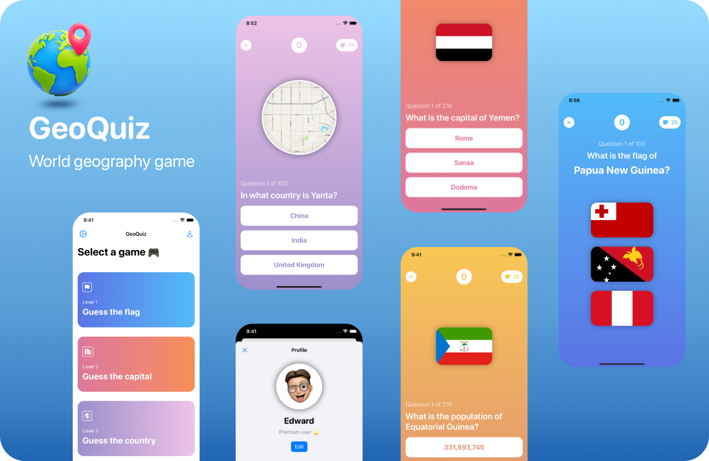

# Welcome to my corner of the internet

I like to code and learn new stuff.

- [Welcome to my corner of the internet](#welcome-to-my-corner-of-the-internet)
  - [iOS apps](#ios-apps)
  - [Open source iOS apps](#open-source-ios-apps)
  - [Libraries](#libraries)
  - [Other projects](#other-projects)
  - [Contact me](#contact-me)

## iOS apps

Apps and games currently published on the App Store

## Open source iOS apps

Some of my very first apps that I removed from the App Store and open source them. *Don't look at the code, it's very bad*

- **Simoleon:** A currency converter [[Source code]](https://github.com/denniscmartin/simoleon)
- **Moness:** An investment tracker [[Source code](https://github.com/denniscmartin/moness)]
- **My first app:** A stock analyser [[Source code](https://github.com/denniscmartin/lazybear)]

## Libraries

- A simple extension to round specific corners of shapes in SwiftUI [[Source code](https://github.com/denniscmartin/dt-roundedcorners)]
- A generic implementation of a photo picker for SwiftUI using PhotosUI [[Source code](https://github.com/denniscmartin/dt-photopicker)]
- Display interactive charts in SwiftUI [[Source code](https://github.com/denniscmartin/stock-charts)]
- An experiment on Swift networking [[Source code](https://github.com/denniscmartin/bazooka)]

## Other projects

Projects to learn a specific topic, framework, or programming language.

- A maze solver written in C [[Source code](https://github.com/denniscmartin/maze-solver)]
- A script to render random 3D cubes in blender [[Source code](https://github.com/denniscmartin/the-cube-project)]
- A Bitcoin blockchain parser written in Python [[Source code](https://github.com/denniscmartin/bitcaviar-plus)]
- Serverless app to fetch & analyse tweets using AWS Comprehend [[Source code](https://github.com/denniscmartin/tweet-analysis)]

## Contact me
[Twitter](https://twitter.com/dennistech_) - [Email](mailto:dmartin@dennistech.io)
